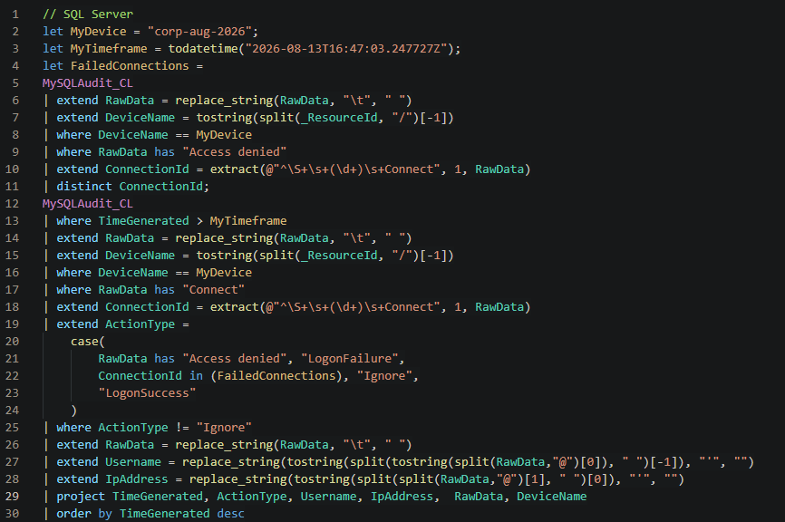
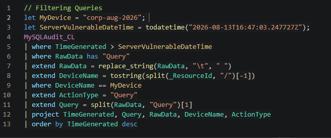
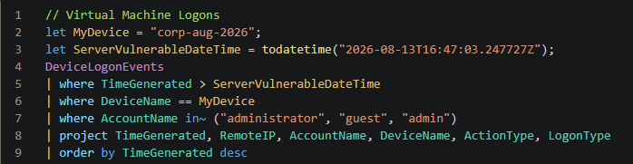
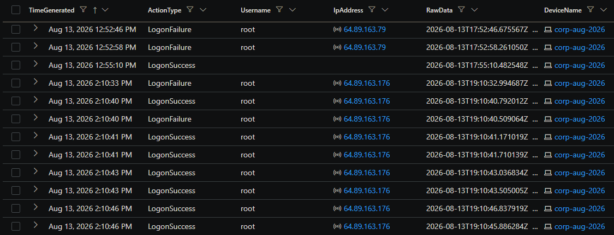
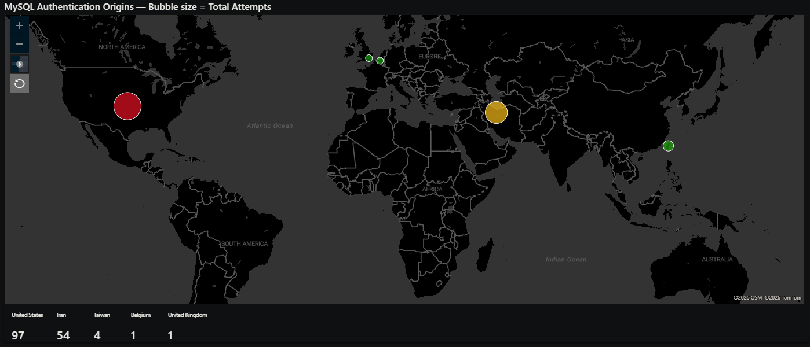
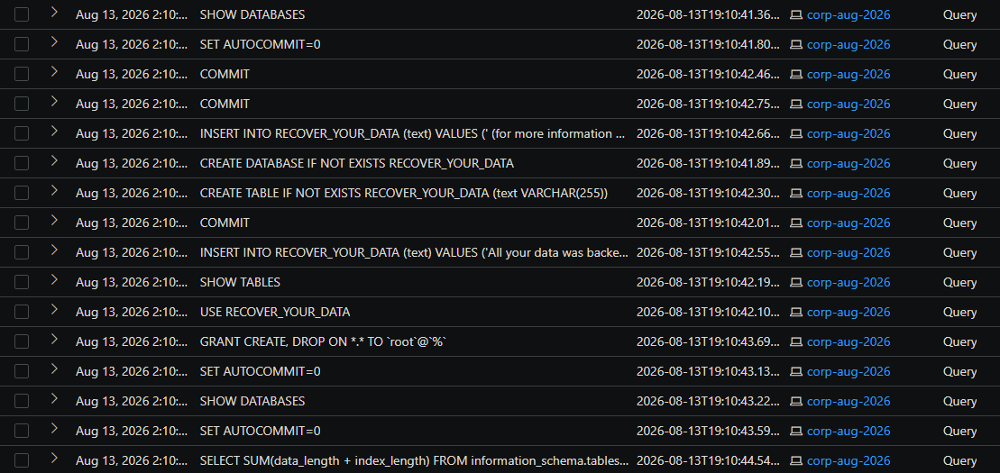
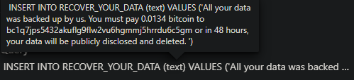
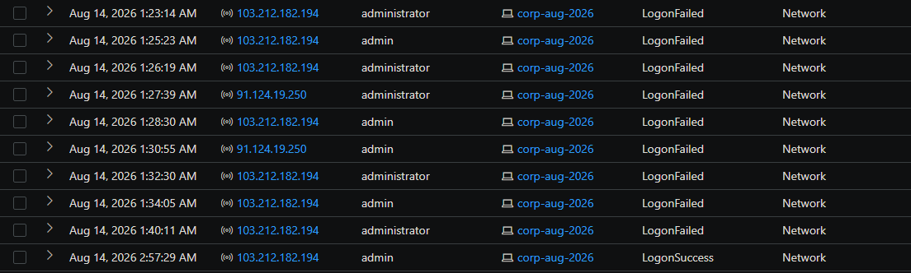
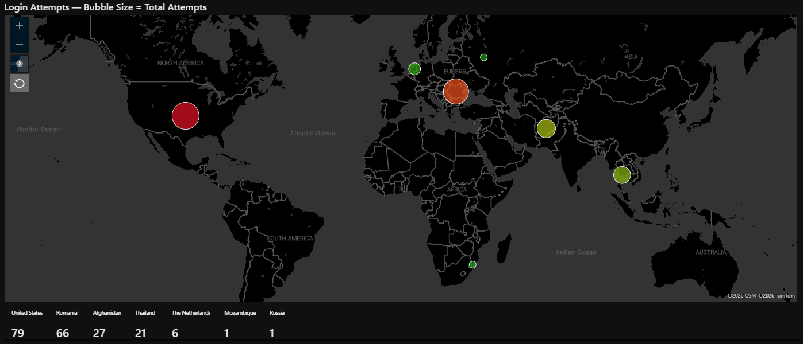

# CYBER RANGE CAPSTONE

## Live-Exposed Azure Honeypot

### Detection, Compromise Analysis, and Recovery

---

**PORTFOLIO PROJECT REPORT**

**Environment:** Microsoft Azure | Windows 11 | MySQL 8.0

**Security stack:** Microsoft Defender for Endpoint | Microsoft Sentinel | Log Analytics

**Honeypot host:** CORP-AUG-2026

**Exposure timestamp:** 2026-08-13T16:47:03.247727Z

**Prepared by:** Zachary Crumley

*This project used only synthetic corporate data and an intentionally vulnerable lab system.*

## Executive Summary

This lab built an internet-exposed Windows honeypot in Microsoft Azure, installed and populated a MySQL database with synthetic corporate data, onboarded the host to Microsoft Defender for Endpoint, and forwarded MySQL audit/general logs into Log Analytics for hunting and detection. A clean baseline and pre-breach investigation package were captured before the system was intentionally weakened and exposed.

The database was attacked first. After the recorded exposure time, the first failed MySQL authentication appeared about one hour later, and the first confirmed external root login occurred at 19:10:40Z—approximately 2 hours 23 minutes after exposure. The same source immediately created a ransom database, queried sensitive-looking dummy tables, dropped the original databases, tampered with logging/privileges, and issued a database shutdown command. The Windows host was also heavily probed; the filtered Defender logon export contains 84 failed logons and two externally sourced successful admin logons, with the first success occurring the following morning.

Defender process, file, and registry telemetry did not identify a host-side payload, attacker-attributable file modification, or persistence mechanism after the VM logons. The pre/post investigation-package comparison also did not show a new installed application attributable to an attacker. The strongest confirmed impact was therefore the MySQL compromise and database destruction/ransom operation. Outbound command-and-control or data exfiltration was not determined from the available exports because DeviceNetworkEvents/NTANetAnalytics evidence was not included in the provided dataset.

| **2h 23m** | **~35 sec** | **80** | **84** |
|---|---|---|---|
| Exposure → first external MySQL root success | Root success → first database drop | External MySQL root-success records | Failed VM admin/administrator logons |

> **OUTCOME**  
> The lab demonstrated the full defensive lifecycle: build and instrument a system, establish a baseline, deploy detections, deliberately expose weak services, analyze a live compromise, isolate the asset, recover from known-good state, and document lessons learned.

### Key Findings

- MySQL root access was achieved from 64.89.163.176 at 2026-08-13T19:10:40.792012Z.

- The attacker/script accessed synthetic tables including credentials, customers, orders, and payments, then dropped lnp_corp, sakila, world, and the prior recovery database.

- A RECOVER_YOUR_DATA database/table was created with a ransom demand for 0.0134 BTC, a Bitcoin address, an onionmail contact, and a DATAID.

- Subsequent MySQL activity came from multiple additional external sources and repeatedly used the root account, consistent with automated internet-wide scanning and commodity database-ransomware activity.

- The VM received repeated brute-force attempts against admin/administrator and recorded successful network logons, but no attacker-attributable host file/process/registry changes were confirmed in the supplied MDE hunting exports.

- No ransom was paid. The environment was isolated and recovered from a known-good state/backup, then re-hardened.

## 1. Lab Objective and Environment

The objective was to observe real internet threat activity against a deliberately vulnerable but contained enterprise-style asset. The system was designed as a honeypot: it looked like a corporate Windows workstation/server, hosted a MySQL database populated with dummy business data, and exposed realistic authentication surfaces while collecting telemetry for detection and incident response.

### Environment

| **Component**      | **Implementation**                                                                         |
|--------------------|--------------------------------------------------------------------------------------------|
| Cloud platform     | Microsoft Azure virtual network and public IP                                              |
| Honeypot host      | Windows 11 VM named CORP-AUG-2026                                                          |
| Database           | MySQL 8.0 with synthetic lnp_corp data plus default sample schemas                         |
| Endpoint telemetry | Microsoft Defender for Endpoint (MDE)                                                      |
| Database telemetry | MySQL general log → Azure Monitor Agent/Data Collection Rule → MySQLAudit_CL               |
| SIEM / hunting     | Microsoft Sentinel and Log Analytics using KQL                                             |
| Forensic baseline  | MDE investigation package captured before exposure and a second package after the incident |

### Preparation and Instrumentation

The environment was initially built in a hardened state. MySQL general logging was enabled and written to the local mysql_general.log file. A custom-text-log Data Collection Rule forwarded that file to the MySQLAudit_CL custom table in LAW-Cyber-Range. Endpoint telemetry was verified in Defender before exposure, and detection logic was authored while the environment was still clean so alerts would exist before the incident began.

### Controlled Weakening

After baseline collection, the honeypot was intentionally weakened in a controlled sequence. The Windows firewall was disabled, the Network Security Group was changed to allow inbound traffic, weak local accounts were enabled/configured for remote access, and MySQL was made remotely reachable with intentionally weak root authentication. The recorded exposure timestamp was 2026-08-13T16:47:03.247727Z.

> **SAFETY BOUNDARY**  
> This was a lab environment containing dummy data. The architecture was intentionally isolated from production assets, and the exercise was designed to study attacker behavior without placing real business data at risk.

### Evidence Used in This Report

The analysis below is grounded in the supplied Microsoft Defender Advanced Hunting exports, MySQL authentication/query exports, pre/post Defender investigation packages, the lab checklist, and the screenshots captured during hunting. Where the evidence cannot support a conclusion, the report states that the result was not determined rather than assuming attacker behavior.

## 2. Detection Engineering and Threat Hunting

Detection logic focused on two primary compromise paths: successful remote logons to the Windows honeypot and successful authentication to MySQL. The queries were filtered to CORP-AUG-2026 and to activity after the recorded exposure timestamp. Additional hunting queries were used to parse raw MySQL log records into username, source IP, action type, and query text.

### MySQL Authentication Hunting

The MySQL hunting query normalizes tab-delimited RawData, extracts connection IDs, identifies failed connections, classifies successful connections, and parses the username and remote IP. This transformed the custom text log into fields that could be used for detections and investigation.

*Figure 1 — KQL used to classify MySQL authentication attempts for CORP-AUG-2026.*

### Database Query Hunting

A second KQL query filtered MySQLAudit_CL for Query records after exposure and projected the command text. This made destructive and reconnaissance actions—such as SHOW DATABASES, SELECT statements, DROP DATABASE, privilege changes, and SHUTDOWN—directly visible in the timeline.

*Figure 2 — KQL used to isolate post-exposure MySQL query activity.*

### VM Authentication Hunting

DeviceLogonEvents was filtered to the honeypot and the intentionally weak admin/administrator/guest accounts. The result set preserved remote IP, account, action type, and logon type for correlation with endpoint process, file, and registry telemetry.

*Figure 3 — Defender KQL used to hunt Windows logon activity after exposure.*

## 3. MySQL Compromise Analysis

MySQL was the first component to show confirmed compromise. The authentication export contains 76 failed login records and 80 successful root-authentication records with a populated external IP across the collection window. Eleven distinct external IPs produced at least one successful authentication, while failed attempts tested usernames including root, admin, sa, nexpose, test, and other common/default names.

### Initial Access

At 2026-08-13T17:52:46.675567Z—about 1 hour 5 minutes after exposure—the first post-exposure MySQL failure in the export targeted root from 64.89.163.79. At 2026-08-13T19:10:40.792012Z, 64.89.163.176 successfully authenticated as root. The same source opened a rapid series of additional root connections to multiple schemas.

*Figure 4 — MySQL authentication results showing failed probing followed by repeated root successes from 64.89.163.176.*

### Authentication Origins

The workbook visualization shows MySQL authentication activity from multiple countries, including the United States, Iran, Taiwan, Belgium, and the United Kingdom. Geolocation is approximate and should be interpreted as infrastructure location rather than attacker identity.

*Figure 5 — Geographic visualization of MySQL authentication origins during the observation window.*

> **ANALYST ASSESSMENT**  
> The volume, repeated username testing, rapid reconnection behavior, and reuse of a scripted ransom workflow are consistent with automated scanning/bot activity rather than a manually operated, targeted intrusion. This is an analytical inference; the logs do not identify the human or organization controlling the infrastructure.

## 4. Database Ransomware Sequence

The first successful root session transitioned almost immediately from access to impact. The query log records a scripted workflow that created a recovery/ransom schema, enumerated database contents, read synthetic corporate tables, destroyed the databases, modified privileges/logging state, and shut down MySQL.

| **UTC timestamp**         | **Observed action**                                        | **Interpretation**                                                     |
|---------------------------|------------------------------------------------------------|------------------------------------------------------------------------|
| 19:10:40.792              | root@64.89.163.176 connects                                | Confirmed external privileged access                                   |
| 19:10:41.896              | CREATE DATABASE IF NOT EXISTS RECOVER_YOUR_DATA            | Ransom staging begins                                                  |
| 19:10:42.554              | Ransom note inserted                                       | Payment demand and recovery instructions written                       |
| 19:10:45–19:10:48         | SELECT \* from credentials, customers, orders, payments    | Synthetic business data accessed/collected; exfiltration not confirmed |
| 19:11:15.540–19:11:16.500 | DROP DATABASE lnp_corp, recover_your_data, sakila, world   | Destructive impact                                                     |
| 19:11:17                  | RECOVER_YOUR_DATA recreated and ransom text inserted again | Ransom note left after destruction                                     |
| 19:11:18.375              | RESET MASTER                                               | Attempt to reset database binary-log state                             |
| 19:11:18.983              | PURGE BINARY LOGS ...                                      | Attempt to remove/alter binlog history                                 |
| 19:11:19.484              | REVOKE ALL PRIVILEGES ... root@%                           | Remote root privileges altered                                         |
| 19:11:20.426              | SHUTDOWN                                                   | Database service shutdown command issued                               |

*Figure 6 — Post-exposure MySQL query results showing the scripted ransom workflow.*

### Ransom Artifact

The inserted text demanded 0.0134 BTC and threatened public disclosure/deletion within 48 hours. The note included Bitcoin address bc1q7jps5432akuflg9flw2vu6hgmmj5hrrdu6c5gm, contact address ak+2ijj5@onionmail.org, the shortened URL bit.ly/22mysql, and DATAID 2IJJ5. These values were recorded as incident indicators; no payment was made.

*Figure 7 — Ransom note text captured directly from the MySQL query log.*

### Impact Assessment

The logs confirm unauthorized privileged database access, bulk reads of synthetic tables, destructive deletion of multiple schemas, creation of a ransom artifact, privilege manipulation, and a shutdown command. The query history supports data access/collection but does not prove that data left the environment. Because a DeviceNetworkEvents/NTANetAnalytics export was not provided with the evidence set, successful exfiltration is not determined from available logs.

## 5. Windows VM Authentication and Host Analysis

The Windows VM took longer to record a successful remote logon. In the supplied filtered DeviceLogonEvents export, 84 failed attempts targeted admin/administrator from five populated remote IPs. Two externally sourced successful admin logons were observed; each success also had a companion record at the same timestamp with RemoteIP not populated.

| **Defender UI time**     | **Source**      | **Account** | **Result**             |
|--------------------------|-----------------|-------------|------------------------|
| Aug 14, 2026 2:57:29 AM  | 103.212.182.194 | admin       | LogonSuccess (Network) |
| Aug 14, 2026 12:43:56 PM | 217.160.151.42  | admin       | LogonSuccess (Network) |

The first external admin success occurred approximately 15 hours 10 minutes after the recorded exposure time when the exposure timestamp is converted to the same Central Time context used by the Defender UI export. Prior to that success, repeated failures rotated between admin and administrator, a pattern consistent with brute-force or password-spraying automation.

*Figure 8 — Repeated failed VM logons followed by a successful admin network logon.*

### Host-Side Activity After Successful Logon

The first successful logon correlates with normal Windows session-related processes such as smss.exe, csrss.exe, winlogon.exe, LogonUI.exe, and dwm.exe. However, the Advanced Hunting exports contain no DeviceProcessEvents executed under admin, administrator, or guest; there were no DeviceFileEvents attributed to those accounts; and no attacker-attributable registry change was identified. The later success similarly overlaps with routine Windows/system application maintenance activity rather than a clear malicious payload.

> **HOST FINDING**  
> Successful network authentication is confirmed, but post-authentication execution, persistence, malware installation, and host-file impact are not determined from available logs. The evidence does not support claiming that the attacker executed a payload on Windows.

### Geographic Distribution of VM Probing

The host-login workbook visualization shows broad international scanning against the exposed asset, with activity represented from the United States, Romania, Afghanistan, Thailand, the Netherlands, Mozambique, and Russia. This illustrates how quickly an exposed service becomes part of the global scanning ecosystem.

*Figure 9 — Country-level visualization of login attempts against the exposed honeypot.*

## 6. Pre/Post Defender Investigation Package Comparison

A Defender investigation package was captured before exposure and a second package after the incident. Comparing the packages provided a machine-level check for software installation, account/group changes, active processes, temporary artifacts, and new prefetch evidence.

| **Artifact**       | **Observed difference**                                                                                                                      | **Assessment**                                                                       |
|--------------------|----------------------------------------------------------------------------------------------------------------------------------------------|--------------------------------------------------------------------------------------|
| Installed Programs | InstalledPrograms.csv was unchanged between packages.                                                                                        | No evidence of a newly installed application attributable to the attacker.           |
| Local Groups       | The lab-created admin account appears in the post package in Administrators/Users.                                                           | Expected result of the intentional weakening step, not attacker-created persistence. |
| Temp Directories   | A post-package admin temp listing exists, but the collection reports the path could not be found.                                            | No recoverable attacker temp artifact from this item.                                |
| Process Snapshot   | Post snapshot contains normal Windows, Defender, Azure agent, MySQL, Edge/WebView, OneDrive, and M365 components.                            | No clearly malicious new process name identified in the snapshot.                    |
| Prefetch           | Additional prefetch files largely correspond to Defender definitions, Windows servicing, Edge/WebView, security-health, and normal OS tools. | Changes are not sufficient to attribute execution to the attacker.                   |

The comparison therefore supports the Advanced Hunting result: the database compromise produced clear malicious artifacts, while the Windows host did not show a comparable attacker-installed payload or persistence mechanism in the supplied evidence. This does not prove that no host action occurred; it means no such action was established by the available package and hunting data.

### Evidence Gaps

- DeviceNetworkEvents and NTANetAnalytics exports were not supplied, so outbound C2, mining, or exfiltration attempts cannot be reconstructed from this evidence set.

- The Security.evtx files were collected in the investigation packages, but the provided report dataset did not include a parsed event-log export tying the successful admin logons to a specific interactive command sequence.

- Remote IP geolocation visualizations indicate infrastructure location only and do not establish attacker nationality or identity.

- The MySQL query log proves reads of synthetic tables but not successful transfer of those records outside the environment.

## 7. Containment, Eradication, and Recovery

### Containment

After sufficient evidence was collected, the VM was isolated through Microsoft Defender to stop further interaction with the host. A post-breach investigation package was captured before recovery so the compromised-state evidence could be compared against the pre-breach baseline.

### Eradication and Recovery

The VM was returned to a known-good pre-breach state and hardened. The compromised MySQL environment was restored from a known-good backup rather than attempting to trust the attacker-modified database state. No ransom was paid.

### Hardening Actions

The recovery phase reversed the intentionally weak configuration and restored the controls required for a normal production posture:

- Restrict the Azure Network Security Group instead of allowing all inbound traffic.

- Re-enable Windows Firewall and perform a full Microsoft Defender malware scan.

- Remove the intentionally weak admin account and leave Guest disabled.

- Use a strong local username/password and limit remote logon exposure.

- Remove public internet access to MySQL; do not expose database authentication directly to arbitrary sources.

- Remove or strongly secure the network-accessible root account and apply least privilege.

- Restore MySQL data from the known-good backup and validate the restored schemas before returning the service to use.

> **RECOVERY PRINCIPLE**  
> Because the database state was intentionally modified by an untrusted remote actor, restoring from a known-good backup provided stronger assurance than attempting to manually reverse each destructive query.

### Post-Recovery Validation

The environment was returned to a hardened configuration and the collected logs/packages were retained for further analysis. In a production incident, validation would also include credential rotation, confirmation that inbound exposure is restricted, review of EDR/SIEM detections, verification of backup integrity, and monitoring for any recurrence of the identified indicators.

## 8. Lessons Learned and Portfolio Takeaways

The most important result was the speed and automation of internet-facing attacks. The database moved from exposure to privileged external access in roughly two and a half hours, and the destructive sequence unfolded in seconds. The host also experienced sustained username/password guessing from multiple international sources. The lab made the difference between “an exposed service could be attacked” and observing the actual telemetry of that attack in real time.

### Security Lessons

- Internet exposure is itself a risk multiplier. Weak credentials and open management/database ports are discovered quickly by automated scanners.

- Database logging is operationally valuable. Without the MySQL general log ingested into Log Analytics, the destructive sequence would have been much harder to reconstruct.

- Detection must exist before exposure. Pre-built analytics rules and known-good baselines make incident identification and scoping substantially faster.

- A successful login is not the same as proven malware execution. Host telemetry should be used to separate confirmed authentication from assumptions about post-login activity.

- Backups are a security control. A known-good database backup enabled recovery without paying the ransom or trusting the attacker-modified state.

- Evidence quality matters. Preserving pre/post investigation packages, KQL results, screenshots, and raw logs made it possible to distinguish confirmed impact from unknowns.

### Skills Demonstrated

| **Area**              | **Hands-on work demonstrated**                                                                              |
|-----------------------|-------------------------------------------------------------------------------------------------------------|
| Azure security        | Virtual network/VM deployment, public exposure controls, NSG hardening                                      |
| Endpoint security     | Microsoft Defender for Endpoint onboarding, DeviceLogonEvents/Process/File/Registry hunting, host isolation |
| SIEM / logging        | Log Analytics workspace, Azure Monitor Agent, custom Data Collection Rule, custom MySQLAudit_CL ingestion   |
| Detection engineering | KQL parsing, filtering, classification of success/failure, Sentinel analytics-rule workflow                 |
| Threat hunting        | Correlation of authentication, database query, process, file, registry, and forensic package evidence       |
| Incident response     | Preparation, detection, analysis, containment, eradication, recovery, lessons learned                       |
| Forensics             | Pre/post Defender investigation-package comparison and evidence-gap analysis                                |
| Reporting             | Evidence-based incident narrative with explicit separation of confirmed findings and unverified assumptions |

### Indicators Recorded From the Lab

| **Type**                         | **Value / context**                        |
|----------------------------------|--------------------------------------------|
| Primary MySQL destructive source | 64.89.163.176                              |
| VM successful logon sources      | 103.212.182.194; 217.160.151.42            |
| Bitcoin address                  | bc1q7jps5432akuflg9flw2vu6hgmmj5hrrdu6c5gm |
| Contact email                    | ak+2ijj5@onionmail.org                     |
| Ransom URL                       | bit.ly/22mysql                             |
| Data identifier                  | 2IJJ5                                      |

### Conclusion

This lab provided an end-to-end view of how a weak internet-facing asset is discovered, authenticated to, and abused. The MySQL evidence captured a complete progression from credential probing to privileged access, data discovery/collection, destructive database operations, ransom-note creation, anti-recovery/log tampering attempts, and shutdown. The Windows evidence showed successful remote authentication but did not support a claim of host malware or persistence. The exercise reinforced the practical value of hardening, centralized logging, pre-positioned detections, evidence preservation, and recovery from known-good backups.

### Evidence Files

- AdvancedHuntingResults-SQL Server.csv

- AdvancedHuntingResults-Filter Query.csv

- AdvancedHuntingResults-VM Login.csv

- AdvancedHuntingResults-VM DeviceProcessEvents.csv

- AdvancedHuntingResults-VM DeviceFileEvents.csv

- AdvancedHuntingResults-VM DeviceRegistryEvents.csv

- MDE_Investigation_Package_Pre.zip

- MDE_Investigation_Package_Post.zip

- Copy of Cyber Defense Final — Advanced Honey Pot w_Live Breach.docx

- Report Draft- Final.docx

*Portfolio note: All business records were synthetic, and the system was intentionally exposed for a controlled cybersecurity lab. Public IP addresses are retained only as technical indicators associated with this lab window.*
